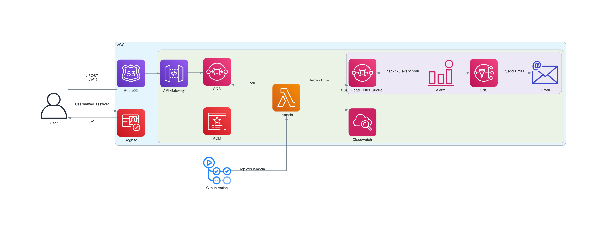
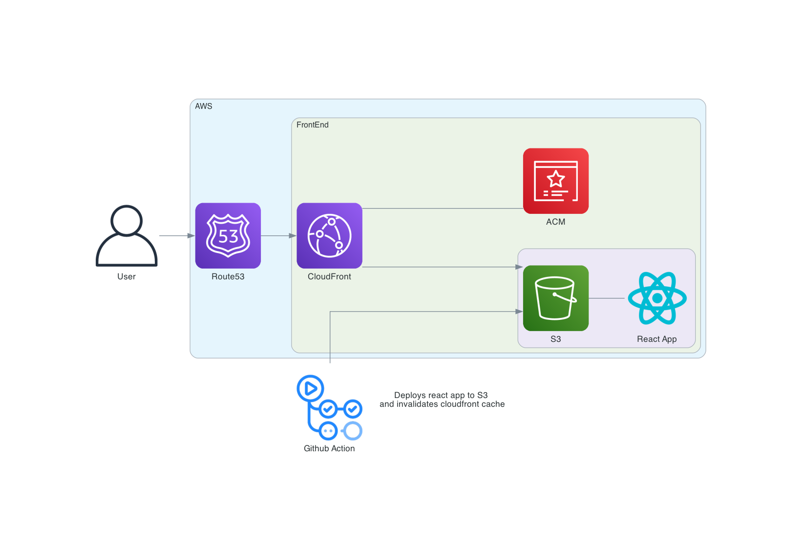

# aws-queue-demo

Demo Project to explore setting up a queue workflow with SQS and Cognito.

Client can add messages to a queue, lambda processes queue messages and adds to DLQ if error.

## Architecture Diagram

Backend

Frontend

