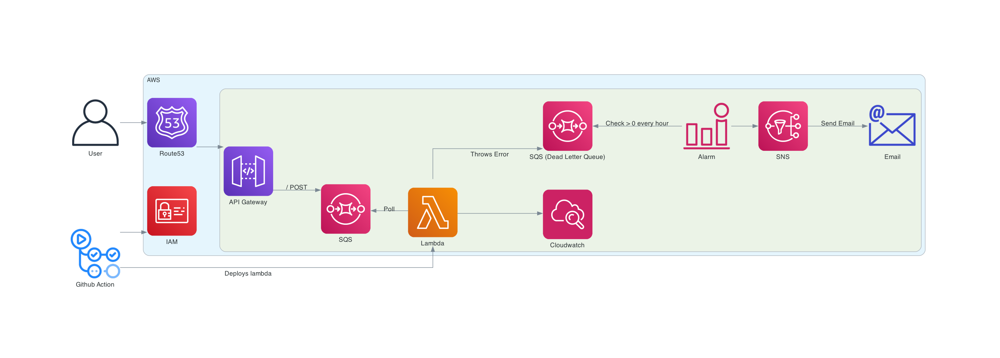
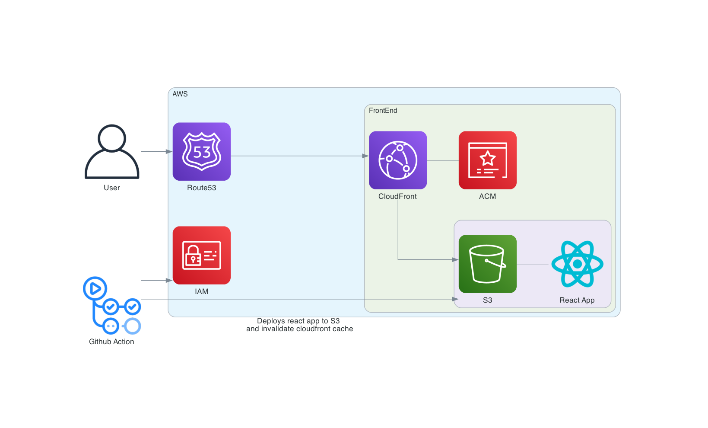

# Infastructure

## Overview

- CloudFormation templates used to deploy infastructure on AWS.
- GitHub action runs on push to main branch.
  - Builds lambda package and deploys.

## Architecture Diagram

Backend

Frontend

### Environment variables for lambda

Add `TOPIC_ARN` environment variables for the lamba.
